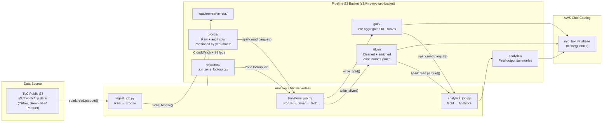
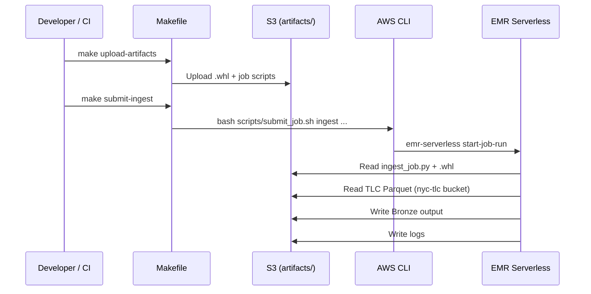

# Design Documentation — NYC Taxi ETL & Analytics Pipeline

## Table of Contents
1. [Architecture Overview](#1-architecture-overview)
2. [Project Structure](#2-project-structure)
3. [Data Layer Definitions (Medallion Architecture)](#3-data-layer-definitions)
4. [Component Descriptions](#4-component-descriptions)
5. [EMR Serverless Deployment Design](#5-emr-serverless-deployment-design)
6. [Analytics Catalogue](#6-analytics-catalogue)
7. [IAM & Security](#7-iam--security)
8. [Testing Strategy](#8-testing-strategy)

---

## 1. Architecture Overview



---

## 2. Project Structure

```
nyc-taxi-etl-pyspark/
├── conf/
│   ├── emr_serverless_job.json   # EMR Serverless app + job config reference
│   └── spark_conf.py             # Tuning constants (executor memory, partitions)
├── src/
│   ├── config.py                 # S3 paths, env vars, date ranges
│   ├── ingestion/
│   │   ├── schema.py             # Explicit StructType schemas (Yellow, Green, FHV)
│   │   └── reader.py             # Reads TLC Parquet directly from S3
│   ├── transformation/
│   │   ├── bronze.py             # Raw → Bronze (rename + audit columns)
│   │   ├── silver.py             # Bronze → Silver (clean, enrich, zone join)
│   │   └── gold.py               # Silver → Gold (KPI aggregations)
│   ├── analytics/
│   │   ├── demand_analysis.py
│   │   ├── fare_analysis.py
│   │   ├── trip_patterns.py
│   │   ├── geo_analysis.py
│   │   └── time_series.py
│   └── utils/
│       ├── spark_session.py      # SparkSession factory (Iceberg + Glue config)
│       └── logger.py             # Structured logger
├── jobs/
│   ├── ingest_job.py             # CLI entrypoint: Ingestion → Bronze
│   ├── transform_job.py          # CLI entrypoint: Bronze → Silver → Gold
│   └── analytics_job.py         # CLI entrypoint: Gold → Analytics
├── scripts/
│   ├── bootstrap.sh              # EMR bootstrap: installs wheel from S3
│   └── submit_job.sh            # AWS CLI job submission helper
├── tests/
│   ├── conftest.py               # Shared SparkSession + sample DataFrames
│   ├── unit/                     # test_bronze.py, test_silver.py, test_gold.py
│   └── integration/              # test_pipeline_e2e.py
├── data/sample/                  # Small local fixtures (gitignored *.parquet)
├── notebooks/                    # EMR Studio compatible Jupyter notebooks
├── main.py                       # Local dev runner (chains all three stages)
├── requirements.txt
├── pyproject.toml                # Build + ruff + pytest config
├── Makefile                      # Shortcuts: lint, test, build, upload, submit
└── .github/workflows/ci.yml      # GitHub Actions: lint + unit tests on push
```

---

## 3. Data Layer Definitions

### Bronze Layer — `s3://my-nyc-taxi-bucket/bronze/<trip_type>/`

| Property | Detail |
|---|---|
| **Purpose** | Faithful, timestamped copy of raw TLC data |
| **Transformations** | Column rename to snake_case; add `_ingested_at`, `_trip_type`, `_source_file` |
| **Row drops** | None — Bronze is append-only raw storage |
| **Format** | Parquet |
| **Partitioning** | `year=YYYY/month=MM` derived from pickup datetime |
| **Audit columns** | `_ingested_at TIMESTAMP`, `_trip_type STRING`, `_source_file STRING` |

### Silver Layer — `s3://my-nyc-taxi-bucket/silver/<trip_type>/`

| Property | Detail |
|---|---|
| **Purpose** | Clean, trusted, query-ready data |
| **Transformations** | Null drops on primary keys; outlier filtering (see thresholds below); datetime enrichment; taxi zone lookup join |
| **Quality thresholds** | `trip_distance` ∈ [0.01, 200] miles; `fare_amount` ∈ [0, 500]; trip duration ∈ [60s, 43200s]; `passenger_count > 0` |
| **Enrichments** | `pickup_datetime_local` (US/Eastern); `pickup_hour`, `pickup_day_of_week`, `is_weekend`; `pickup_borough`, `pickup_zone`, `dropoff_borough`, `dropoff_zone`; `trip_duration_mins`; `is_airport_trip` |
| **Format** | Parquet |
| **Partitioning** | `pickup_year=YYYY/pickup_month=MM` |

### Gold Layer — `s3://my-nyc-taxi-bucket/gold/<table_name>/<trip_type>/`

Pre-aggregated KPI tables — one Parquet file set per table per trip type.

| Table | Description |
|---|---|
| `trips_by_hour` | Trip count + avg fare per hour-of-day, year, month |
| `trips_by_date` | Daily trip count, total revenue, avg fare, avg distance, avg duration |
| `trips_by_borough` | Trip count + revenue per pickup borough, year, month |
| `fare_summary` | Fare stats (avg, median, P95, tip %) by payment type (Yellow/Green only) |
| `trip_duration_summary` | Duration percentiles (P25, P50, P75, P95) by year/month |

---

## 4. Component Descriptions

### `src/ingestion/schema.py`
Defines strict `pyspark.sql.types.StructType` schemas for Yellow, Green, and FHV trips. Schema enforcement avoids inference overhead on large datasets and prevents silent type widening across TLC data releases.

### `src/ingestion/reader.py`
Constructs TLC S3 URIs from trip type + date range, reads Parquet with the explicit schema, and attaches `_source_file` using `input_file_name()` for data lineage.

### `src/transformation/bronze.py`
- Renames raw column names to snake_case per trip type.
- Adds `_ingested_at` (current timestamp), `_trip_type` (literal), `_source_file`.
- Derives `year` and `month` partition columns.
- **No rows dropped.**

### `src/transformation/silver.py`
- `_drop_nulls()` — drops rows missing pickup/dropoff datetime, location IDs, fare, distance.
- `_filter_outliers()` — IQR-safe range filters for distance, fare, duration, passenger count.
- `_enrich_datetime()` — converts to US/Eastern; adds hour, day-of-week, weekend flag.
- `_join_zones()` — left-joins with taxi zone lookup CSV for borough and zone name.
- Adds `trip_duration_mins` and `is_airport_trip` (location IDs 1, 132, 138).

### `src/transformation/gold.py`
Five builder functions, each returning a grouped/aggregated Spark DataFrame. Orchestrated by `transform_to_gold()`, which returns a `dict[str, DataFrame]`.

### `src/analytics/`
Each module reads Gold (or Silver) data and writes focused analytical summaries:

| Module | Key functions |
|---|---|
| `demand_analysis` | `hourly_demand_profile`, `daily_trip_trend`, `borough_demand_breakdown`, `mom_trip_volume` |
| `fare_analysis` | `fare_by_distance_bucket`, `tip_percentage_distribution`, `payment_type_trend`, `top_revenue_zones`, `fare_anomaly_detection` |
| `trip_patterns` | `top_corridors`, `airport_trip_share`, `distance_distribution_by_borough`, `busiest_pickup_zones`, `hourly_pattern_by_day_type` |
| `geo_analysis` | `zone_trip_volume`, `zone_revenue_per_mile`, `inter_borough_flow`, `zone_net_flow` |
| `time_series` | `monthly_volume_trend`, `covid_impact_recovery`, `seasonal_decomposition_proxy`, `fare_evolution_yoy` |

### `src/utils/spark_session.py`
Builds a `SparkSession` with Iceberg + AWS Glue catalog configuration, S3 EMRFS settings, and AQE enabled. The `local=True` flag switches to `local[*]` master and S3A for unit testing.

### `src/utils/logger.py`
Python `logging` wrapper with ISO-8601 timestamp format, level controlled by `LOG_LEVEL` env var. Produces clean output in both local consoles and CloudWatch via EMR Serverless log forwarding.

---

## 5. EMR Serverless Deployment Design

### Application Configuration

```
Release: emr-7.1.0
Type:    SPARK
Auto-stop: enabled (15 min idle)
Pre-initialised capacity:
  DRIVER   — 1 × (4 vCPU, 16 GB, 20 GB disk)
  EXECUTOR — 10 × (4 vCPU, 16 GB, 20 GB disk)
Maximum capacity: 400 vCPU / 3000 GB
```

### Job Submission Flow



### S3 Bucket Layout

```
s3://my-nyc-taxi-bucket/
├── artifacts/
│   └── nyc_taxi_etl_pyspark-1.0.0-py3-none-any.whl
├── scripts/
│   ├── ingest_job.py
│   ├── transform_job.py
│   ├── analytics_job.py
│   └── bootstrap.sh
├── bronze/
│   ├── yellow/year=2022/month=01/...
│   └── green/...
├── silver/
│   ├── yellow/pickup_year=2022/pickup_month=01/...
│   └── green/...
├── gold/
│   ├── trips_by_hour/yellow/...
│   ├── trips_by_date/yellow/...
│   ├── trips_by_borough/yellow/...
│   ├── fare_summary/yellow/...
│   └── trip_duration_summary/yellow/...
├── analytics/
│   ├── demand/
│   ├── fare/
│   ├── trip_patterns/
│   ├── geo/
│   └── time_series/
├── reference/
│   └── taxi_zone_lookup.csv
├── iceberg-warehouse/
└── logs/emr-serverless/
```

### Dependency Packaging

Dependencies are bundled as a Python wheel (`pyproject.toml` → `python -m build`) and uploaded to S3. Jobs reference it via `--py-files s3://.../*.whl` in `sparkSubmitParameters`. This is cleaner than `--py-files` zips and supports transitive deps.

---

## 6. Analytics Catalogue

| Module | Business Question | Spark Operations | Output Path |
|---|---|---|---|
| **Demand — hourly profile** | What hour of day has peak taxi demand? | `groupBy`, `Window` (row total %), `avg` | `analytics/demand/hourly_demand_profile` |
| **Demand — daily trend** | How has daily trip count changed? | `Window` (7-day rolling avg), `orderBy` | `analytics/demand/daily_trip_trend` |
| **Demand — borough breakdown** | Which borough generates most rides? | `groupBy`, `sum`, relative share | `analytics/demand/borough_demand_breakdown` |
| **Demand — MoM volume** | What is month-over-month volume change? | `Window` lag(1), % change | `analytics/demand/mom_trip_volume` |
| **Fare — by distance** | How does fare scale with distance? | `withColumn` bucket, `groupBy avg` | `analytics/fare/fare_by_distance_bucket` |
| **Fare — tip distribution** | What % of riders tip above 20%? | `withColumn` bucket, `groupBy count` | `analytics/fare/tip_pct_distribution` |
| **Fare — payment trend** | Is card replacing cash over time? | Gold `fare_summary` read, `groupBy` | `analytics/fare/payment_type_trend` |
| **Fare — top revenue zones** | Which zones earn the most? | `groupBy sum`, `orderBy`, `limit` | `analytics/fare/top_20_revenue_zones` |
| **Fare — anomaly detection** | How many anomalous fares per month? | `approxQuantile` IQR, `withColumn flag` | `analytics/fare/fare_anomaly_by_month` |
| **Patterns — corridors** | Top 25 pickup → dropoff pairs? | `groupBy`, `orderBy`, `limit` | `analytics/trip_patterns/top_25_corridors` |
| **Patterns — airport share** | What % of trips are airport-related? | `groupBy is_airport_trip`, count ratio | `analytics/trip_patterns/airport_trip_share` |
| **Patterns — distance by borough** | How far do people travel from each borough? | `percentile_approx` | `analytics/trip_patterns/distance_distribution_by_borough` |
| **Geo — zone volume** | Choropleth-ready pickups + dropoffs per zone | `groupBy location_id`, join pickups/dropoffs | `analytics/geo/zone_trip_volume` |
| **Geo — revenue per mile** | Fare density by zone | `fare/distance`, `groupBy avg` | `analytics/geo/zone_revenue_per_mile` |
| **Geo — inter-borough flow** | Origin-destination matrix at borough level | `groupBy (pickup_borough, dropoff_borough)` | `analytics/geo/inter_borough_flow` |
| **Geo — net flow** | Which zones are exporters vs. importers? | `pickups - dropoffs` per zone | `analytics/geo/zone_net_flow` |
| **Time-series — MoM trend** | Long-term volume trend with YoY comparison | `Window` lag(12), % change | `analytics/time_series/monthly_volume_trend` |
| **Time-series — COVID impact** | When did recovery from COVID occur? | Baseline normalisation, period labelling | `analytics/time_series/covid_impact_recovery` |
| **Time-series — seasonality** | Which months are consistently busiest? | Seasonal index vs. grand mean | `analytics/time_series/seasonal_index` |
| **Time-series — fare evolution** | Have average fares grown year-over-year? | Annual `groupBy`, `Window` lag(1) | `analytics/time_series/fare_evolution_yoy` |

---

## 7. IAM & Security

### EMR Serverless Execution Role

Minimum permissions required:

```json
{
  "Version": "2012-10-17",
  "Statement": [
    {
      "Sid": "ReadTLCPublicBucket",
      "Effect": "Allow",
      "Action": ["s3:GetObject", "s3:ListBucket"],
      "Resource": [
        "arn:aws:s3:::nyc-tlc",
        "arn:aws:s3:::nyc-tlc/*"
      ]
    },
    {
      "Sid": "ReadWritePipelineBucket",
      "Effect": "Allow",
      "Action": ["s3:GetObject", "s3:PutObject", "s3:DeleteObject", "s3:ListBucket"],
      "Resource": [
        "arn:aws:s3:::my-nyc-taxi-bucket",
        "arn:aws:s3:::my-nyc-taxi-bucket/*"
      ]
    },
    {
      "Sid": "GlueCatalog",
      "Effect": "Allow",
      "Action": ["glue:*Database*", "glue:*Table*", "glue:*Partition*"],
      "Resource": ["arn:aws:glue:*:*:catalog", "arn:aws:glue:*:*:database/nyc_taxi", "arn:aws:glue:*:*:table/nyc_taxi/*"]
    },
    {
      "Sid": "CloudWatchLogs",
      "Effect": "Allow",
      "Action": ["logs:CreateLogGroup", "logs:CreateLogStream", "logs:PutLogEvents"],
      "Resource": "arn:aws:logs:*:*:log-group:/aws/emr-serverless/*"
    }
  ]
}
```

---

## 8. Testing Strategy

| Layer | Tool | Coverage |
|---|---|---|
| Unit — Bronze | `pytest` + `pyspark.testing` | Column renames, audit cols, partition derivation, zero row drops |
| Unit — Silver | `pytest` | Null drops, outlier filters, datetime enrichment |
| Unit — Gold | `pytest` | Aggregation correctness, column presence, non-negative counts |
| Integration | `pytest` | Full Bronze → Silver → Gold chain on in-memory sample fixtures |
| CI | GitHub Actions | Lint (ruff) + unit tests on every push/PR |

Test data is generated synthetically in `tests/conftest.py` (no large files committed to git).

